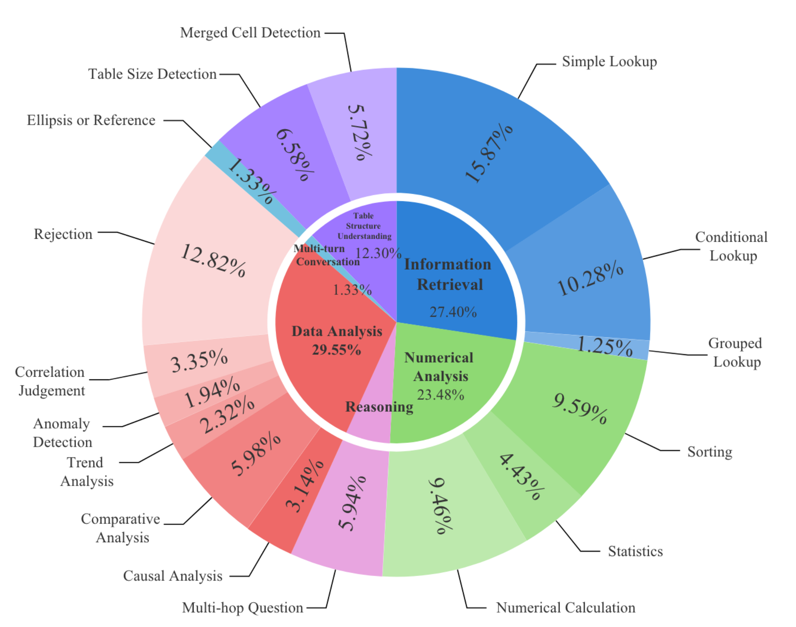
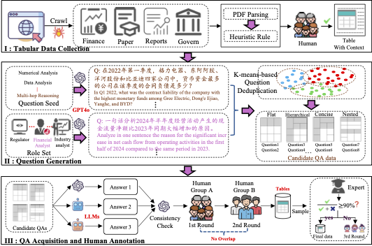

<div align="center"><h1>&nbsp; TableEval </h1></div>

> This repository contains code and data for the paper "TableEval: A Real-World Benchmark for Complex, Multilingual, and Multi-Structured Table Question Answering."


<p align="center">
<font size=5>🤗</font> 
<a target="_self" href="-">
</a>
<font size=5>•</font> 
<font size=5>📄</font>

<a target="_self" href="https://arxiv.org/abs/2506.03949">
  
</a>
</p>


## 🔍 Overview
TableEval is the first cross-language tabular question-answering benchmark supporting Simplified Chinese, Traditional Chinese, and English. It features:

- **Real-World Domains**: Financial Disclosures, Academic Papers, Administrative Records, and Industry Reports.
- **Comprehensive Data:**
  - **617 carefully inspected [Excel spreadsheets](data/tables)** with diverse structures including hierarchical headers, nested cells, and merged layouts.
  - **2,325 QA pairs** across **6 major tasks & 16 fine-grained sub-tasks**, assessesing various capabilities(e.g., information retrieval, reasoning, data analysis, multi-turn conversations).

<div style="text-align: center;"></div>


We also introduce **SEAT**(**S**tructured **E**valuation for **A**nswers in **T**ableQA), a novel evaluation framework that 

- Provides fine-grained evaluation at the sub-question level.
- Leverages LLMs to extract final answers from model responses, comparing them with reference answers one by one and clearly **visualizing correctness**.
- Uses **F1-score** as the evaluation metric and achieves high consistency with human judgments.
<div style="text-align: center;"></div>

<!--  -->


## 🔥 Latest News

- `[2025-06-04]`: We released the benchmark and the code! Please feel free to open an issue or contact us for any questions.


## 🏆 Leaderboard
<table>
    <thead>
        <tr>
            <th style="text-align: center;">Models</th>
            <th style="text-align: center;">Avg </th>
            <th style="text-align: center;">Information Retrieval</th>
            <th style="text-align: center;">Numerical Analysis</th>
            <th style="text-align: center;">Reasoning</th>
            <th style="text-align: center;">Data Analysis</th>
            <th style="text-align: center;">Multi-turn Conversation</th>
            <th style="text-align: center;">Table Structure Understanding</th>
        </tr>
    </thead>
    <tbody>
        <tr>
            <td style="text-align: center;">o1-preview</td>
            <td style="text-align: center;">83.43</td>
            <td style="text-align: center;">88.30</td>
            <td style="text-align: center;">87.08</td>
            <td style="text-align: center;">82.88</td>
            <td style="text-align: center;">77.89</td>
            <td style="text-align: center;">83.38</td>
            <td style="text-align: center;">81.03</td>
        </tr>
        <tr>
            <td style="text-align: center;">claude-3-5-sonnet-20241022</td>
            <td style="text-align: center;">83.32</td>
            <td style="text-align: center;">89.62</td>
            <td style="text-align: center;">91.06</td>
            <td style="text-align: center;">85.76</td>
            <td style="text-align: center;">84.01</td>
            <td style="text-align: center;">87.94</td>
            <td style="text-align: center;">61.51</td>
        </tr>
        <tr>
            <td style="text-align: center;">deepseek-r1</td>
            <td style="text-align: center;">82.46</td>
            <td style="text-align: center;">90.15</td>
            <td style="text-align: center;">88.56</td>
            <td style="text-align: center;">87.91</td>
            <td style="text-align: center;">77.79</td>
            <td style="text-align: center;">78.29</td>
            <td style="text-align: center;">72.05</td>
        </tr>
        <tr>
            <td style="text-align: center;">gpt-4o-2024-11-20</td>
            <td style="text-align: center;">78.79</td>
            <td style="text-align: center;">88.24</td>
            <td style="text-align: center;">86.00</td>
            <td style="text-align: center;">83.05</td>
            <td style="text-align: center;">81.47</td>
            <td style="text-align: center;">83.20</td>
            <td style="text-align: center;">50.79</td>
        </tr>
        <tr>
            <td style="text-align: center;">QwQ-32B-Preview</td>
            <td style="text-align: center;">78.14</td>
            <td style="text-align: center;">89.33</td>
            <td style="text-align: center;">85.75</td>
            <td style="text-align: center;">81.37</td>
            <td style="text-align: center;">71.69</td>
            <td style="text-align: center;">82.15</td>
            <td style="text-align: center;">58.53</td>
        </tr>
        <tr>
            <td style="text-align: center;">deepseek-chat</td>
            <td style="text-align: center;">77.95</td>
            <td style="text-align: center;">91.20</td>
            <td style="text-align: center;">82.61</td>
            <td style="text-align: center;">81.72</td>
            <td style="text-align: center;">77.45</td>
            <td style="text-align: center;">85.83</td>
            <td style="text-align: center;">48.89</td>
        </tr>
        <tr>
            <td style="text-align: center;">Qwen2.5-32B-Instruct</td>
            <td style="text-align: center;">75.50</td>
            <td style="text-align: center;">86.32</td>
            <td style="text-align: center;">84.10</td>
            <td style="text-align: center;">76.09</td>
            <td style="text-align: center;">77.60</td>
            <td style="text-align: center;">82.25</td>
            <td style="text-align: center;">46.61</td>
        </tr>
        <tr>
            <td style="text-align: center;">Qwen2.5-72B-Instruct</td>
            <td style="text-align: center;">74.23</td>
            <td style="text-align: center;">82.68</td>
            <td style="text-align: center;">81.53</td>
            <td style="text-align: center;">74.85</td>
            <td style="text-align: center;">78.94</td>
            <td style="text-align: center;">81.90</td>
            <td style="text-align: center;">45.50</td>
        </tr>
        <tr>
            <td style="text-align: center;">qwen-max-2024-09-19</td>
            <td style="text-align: center;">73.34</td>
            <td style="text-align: center;">84.42</td>
            <td style="text-align: center;">81.35</td>
            <td style="text-align: center;">72.64</td>
            <td style="text-align: center;">78.09</td>
            <td style="text-align: center;">80.18</td>
            <td style="text-align: center;">43.35</td>
        </tr>
        <tr>
            <td style="text-align: center;">DeepSeek-V2.5-1210</td>
            <td style="text-align: center;">73.27</td>
            <td style="text-align: center;">87.41</td>
            <td style="text-align: center;">79.10</td>
            <td style="text-align: center;">71.49</td>
            <td style="text-align: center;">77.97</td>
            <td style="text-align: center;">78.72</td>
            <td style="text-align: center;">44.94</td>
        </tr>
        <tr>
            <td style="text-align: center;">Llama-3.3-70B-Instruct</td>
            <td style="text-align: center;">72.94</td>
            <td style="text-align: center;">87.42</td>
            <td style="text-align: center;">76.70</td>
            <td style="text-align: center;">73.38</td>
            <td style="text-align: center;">81.27</td>
            <td style="text-align: center;">80.62</td>
            <td style="text-align: center;">38.24</td>
        </tr>
        <tr>
            <td style="text-align: center;">Qwen2.5-Coder-32B-Instruct</td>
            <td style="text-align: center;">70.75</td>
            <td style="text-align: center;">79.82</td>
            <td style="text-align: center;">77.00</td>
            <td style="text-align: center;">73.03</td>
            <td style="text-align: center;">76.33</td>
            <td style="text-align: center;">74.89</td>
            <td style="text-align: center;">43.44</td>
        </tr>
        <tr>
            <td style="text-align: center;">Qwen2.5-14B-Instruct</td>
            <td style="text-align: center;">70.02</td>
            <td style="text-align: center;">84.72</td>
            <td style="text-align: center;">78.93</td>
            <td style="text-align: center;">68.65</td>
            <td style="text-align: center;">75.06</td>
            <td style="text-align: center;">75.05</td>
            <td style="text-align: center;">37.72</td>
        </tr>
        <tr>
            <td style="text-align: center;">gpt-4o-mini-2024-07-18</td>
            <td style="text-align: center;">68.47</td>
            <td style="text-align: center;">82.64</td>
            <td style="text-align: center;">76.15</td>
            <td style="text-align: center;">73.13</td>
            <td style="text-align: center;">70.70</td>
            <td style="text-align: center;">73.66</td>
            <td style="text-align: center;">34.56</td>
        </tr>
        <tr>
            <td style="text-align: center;">Qwen2.5-7B-Instruct</td>
            <td style="text-align: center;">59.60</td>
            <td style="text-align: center;">69.23</td>
            <td style="text-align: center;">64.29</td>
            <td style="text-align: center;">59.38</td>
            <td style="text-align: center;">69.71</td>
            <td style="text-align: center;">68.67</td>
            <td style="text-align: center;">26.35</td>
        </tr>
        <tr>
            <td style="text-align: center;">glm-4-9b-chat</td>
            <td style="text-align: center;">53.61</td>
            <td style="text-align: center;">66.19</td>
            <td style="text-align: center;">51.09</td>
            <td style="text-align: center;">55.09</td>
            <td style="text-align: center;">62.47</td>
            <td style="text-align: center;">64.36</td>
            <td style="text-align: center;">22.44</td>
        </tr>
        <tr>
            <td style="text-align: center;">Llama-3.1-8B-Instruct</td>
            <td style="text-align: center;">49.26</td>
            <td style="text-align: center;">67.40</td>
            <td style="text-align: center;">53.35</td>
            <td style="text-align: center;">48.82</td>
            <td style="text-align: center;">57.06</td>
            <td style="text-align: center;">53.15</td>
            <td style="text-align: center;">15.76</td>
        </tr>
        <tr>
            <td style="text-align: center;">DeepSeek-Coder-V2-Lite-Instruct</td>
            <td style="text-align: center;">48.30</td>
            <td style="text-align: center;">60.40</td>
            <td style="text-align: center;">56.39</td>
            <td style="text-align: center;">50.03</td>
            <td style="text-align: center;">51.51</td>
            <td style="text-align: center;">50.62</td>
            <td style="text-align: center;">20.83</td>
        </tr>
        <tr>
            <td style="text-align: center;">DeepSeek-V2-Lite-Chat</td>
            <td style="text-align: center;">36.75</td>
            <td style="text-align: center;">48.52</td>
            <td style="text-align: center;">35.43</td>
            <td style="text-align: center;">35.97</td>
            <td style="text-align: center;">51.80</td>
            <td style="text-align: center;">41.61</td>
            <td style="text-align: center;">7.15</td>
        </tr>
    </tbody>
</table>

(Updated: 25/03/06)

## 🛠️ Installation & Setup

**Step 1: Clone this repository**

```shell
git clone https://github.com/wenge-research/TableEval.git
cd TableEval
```


**Step 2: Create a virtual environment(optional) and install dependencies:**

```shell
conda create -n tableeval python=3.11
conda activate tableeval
pip install -r requirements.txt
```


## 🤖 Evaluate

This section outlines how to configure API keys, generate model responses, and run evaluations. It is designed to help you get started with TableEval quickly.

**Step 1. Configure API keys**

Currently, We only support **OpenAI-compatible API servers**. Please create or update the [`config/api_config.yaml`](config/api_config.yaml) file with your API settings. Ensure your API keys are kept secure and not exposed in public repositories. Below is an example configuration:

```shell
gpt-4o-2024-11-20:
  model_name: gpt-4o-2024-11-20
  api_key: YOUR_OPENAI_API_KEY
  base_url: YOUR_OPENAI_API_URL
  temperature: 0.0
  max_tokens: 8192
  top_p: 1.0
  seed: 33
  timeout: 600    # Request timeout in seconds
  max_retries: 3  # Maximum number of retries if a request fails

YOUR_CUSTOM_API_MODEL:
  model_name: YOUR_CUSTOM_API_MODEL_NAME  
  api_key: YOUR_CUSTOM_API_KEY
  base_url: YOUR_CUSTOM_API_URL
  temperature: 0.6
  max_tokens: 8192
  top_p: 0.95
  seed: 33
  timeout: 600   
  max_retries: 3 
```

If you are using open-source LLMs, we recommend [vLLM](https://github.com/vllm-project/vllm) and [sglang](https://github.com/sgl-project/sglang), which provides an HTTP server compatible with OpenAI’s Chat APIs.


**Step 2: Generate Model Responses**

Run the following command to generate model responses using the specified model:

```shell
python run_prediction.py --model_name gpt-4o-mini
```

This command will call the model to generate responses for the questions and store the results in the `outputs` directory.

**Step 3: Run Evaluation**

After generating responses, execute the following command to run the evaluation:

```shell
python run_evaluation.py --llm_judge_name gpt-4o-2024-11-20 --prediction_file_path ./outputs/20250604_212820/gpt-4o-mini_cot_markdown.json
```

* `--llm_judge_name`: Specifies the judge model name used for evaluation.
* `--prediction_file_path`: Path to the file containing prediction results. Both relative and absolute paths are supported.

Upon successful execution, you can review the evaluation results in the specified output directory. 


**🔧 Advanced Parameter Guide**

`run_prediction.py` and `run_evaluation.py` support more configurable parameters, enabling users to adjust the prediction and evaluation settings:

<details>
<summary><b>Click to expand</b></summary>

To view the **full list of parameters** of `run_prediction.py`, use:

```shell
python run_prediction.py --help
```

parameter details:

| Parameter | Type | Default | Description |
|-----------|------|---------|-------------|
| `--model_name` | `str` | `"gpt-4o-mini"` | Name of the model to use for inference |
| `--test_data_filepath` | `str` | `"./data/TableEval-test.jsonl"` | File path containing evaluation dataset in JSONL format |
| `--config_file` | `str` | `"./config/api_config.yaml"` | YAML configuration file for API authentication parameters |
| `--prompt_file` | `str` | `"./config/prompts.yaml"` | YAML file containing prompt templates for evaluation tasks |
| `--output_directory` | `str` | `"./outputs"` | Directory path to store prediction and evaluation results |
| `--max_workers` | `int` | `5` | Maximum number of parallel worker processes |
| `--context_type` | `str` | `"markdown"` | Table formatting syntax for model input (markdown, html, latex | Default markdown) |
| `--specific_tasks` | `list[str]` | `None` | Filter evaluation tasks by name (Default None=all tasks), e.g. 信息查询  |
| `--specific_ids` | `list[str]` | `None` | Filter dataset samples by ID (Default None=all ids), e.g. 1 2 |


To view the **full list of parameters** of `run_evaluation.py`, use:

```shell
python run_evaluation.py --help
```

parameter details:

| Parameter | Type | Default | Description |
|-----------|------|---------|-------------|
| `--llm_judge_name` | `str` | `"gpt-4o-2024-11-20"` | Name of the LLM judge to use for evaluation |
| `--prediction_file_path` | `str` |  | File path containing prediction result in JSON format |
| `--model_name` | `str` | `"gpt-4o-mini"` | Name of the model to use for inference |
| `--config_file` | `str` | `"./config/api_config.yaml"` | YAML configuration file for API authentication parameters |
| `--prompt_file` | `str` | `"./config/prompts.yaml"` | YAML file containing prompt templates for evaluation tasks |
| `--max_workers` | `int` | `5` | Maximum number of parallel worker processes |


</details>


## 📁 Repository Structure

```
TableEval-main/
├── assets/                  # Static resources (images, diagrams, etc.)
├── config/                  # Configuration files
│   ├── api_config.yaml      # Step 1: Set up api key and other configs
│   ├── prompts.yaml         # LLM prompt templates
│   └── logging.yaml         # Logging format and handlers
├── data/                    # Dataset storage
│   ├── tables/               # Tables in excel format
│   ├── TableEval-meta.jsonl  # Table metadata (context, source, size, etc.)
│   └── TableEval-test.jsonl  # Evaluation dataset with ground truths
├── outputs/                  # Output directory
│   ├── evaluation/           # Evaluation results
│   ├── logs/                 # Log files
│   ├── prediction/           # Model prediction outputs
│   └── scores/               # Final evaluation scores
├── openai_client.py         # OpenAI API client wrapper
├── README.md                
├── requirements.txt        # Python dependencies
├── run_evaluation.py       # Step 3: LlM Evaluation &  Calculate metrics
├── run_prediction.py       # Step 2: Generate model predictions
└── utils.py                # Helper functions                     
```

## 📚 Citation

If you find **TableEval** useful, please consider citing our paper:

```
@misc{zhu2025tableevalrealworldbenchmarkcomplex,
      title={TableEval: A Real-World Benchmark for Complex, Multilingual, and Multi-Structured Table Question Answering}, 
      author={Junnan Zhu and Jingyi Wang and Bohan Yu and Xiaoyu Wu and Junbo Li and Lei Wang and Nan Xu},
      year={2025},
      eprint={2506.03949},
      archivePrefix={arXiv},
      primaryClass={cs.CL},
      url={https://arxiv.org/abs/2506.03949}, 
}
```
